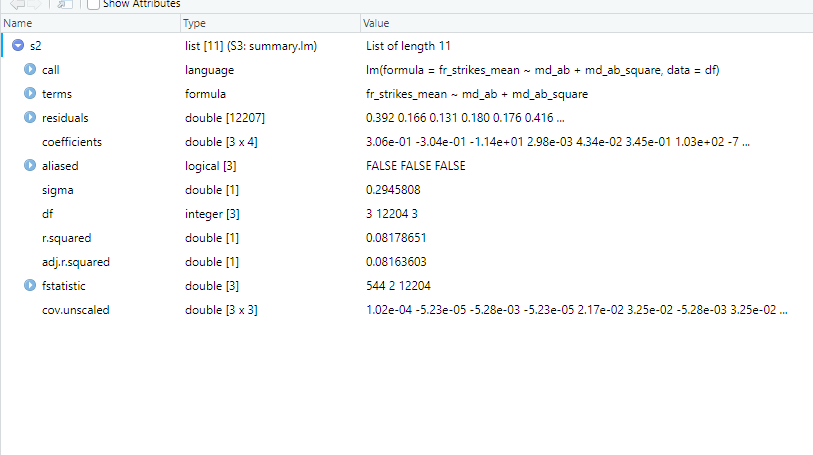

---
output:
  pdf_document: default
  html_document: default
---
# Estimating models

Now we know how to deal with data, we can think about fitting some models!
There are two main ways to do this in R: using routines in packages, or
programming the mathematical operations yourself using matrices. Both have their
upsides and downsides. R is very good at the first, and still very decent - though
not the best language out there - for the second.

The first is typically a lot easier. The main upside of
R is its amazing array of different packages containing almost every model you
would like to use, with lots of options and community support.
The downside is that you have less control. Someone else has decided what summary
statistics to report, which optimiser to use, how to deal with NAs and so on. These
are not always what you would like. We should note, however, that even the package
functions in R are typically much more flexible than alternatives like Stata. It
is much easier to work out, and change, what is going on under the hood. This makes
R a great choice for applied statistics, econometrics, and data science, and is 
part of why R is so popular in these communities. 

The second is typically a bit harder to do. You have to know how to program the
models, all your desired summary statistics etc yourself. The upside is that 
you can choose exactly what you want to do and how to do it. Also, R is less
optimised for matrix operations than dedicated high-performance computing languages like
Julia, or Python 3 with Numba.
Thus, if you only want to program your own estimators and never use packages, maybe
consider these instead (see https://julialang.org/ or https://numba.pydata.org/)

We are going to show you how to fit estimators using functions first.  
We will introduce is using the `lm()` function for linear regression that comes
inbuilt in R, and `sandwich` package for computing different covariance matrices.
Through it, we are going to encounter some useful tips and tricks
for using functions from packages. Afterwards, we will deal with programming your
own estimators using matrix programming.

## Modelling with functions

### Linear regression with `lm()`

The `lm` function is how
we perform OLS in R. Most of the models you will encounter in R packages are built
off of this base function. Through it, we are going to encounter some useful tips and tricks
for using inbuilt functions. Thus, there are high returns to knowing how it works and reports
summary statistics. In the workflow section, we will see how to automatically
make nice latex regression tables from `lm` objects
and `sandwich` standard errors with `stargazer()`.


```r
# lets read in a new dataframe


# read.csv allows us to read a csv file into R. The `as.data.frame' wrapper
# tells R that we want the object to be represented as a dataframe

# For illustration, we are going to use some of the data from Dell and Querubin (2017)
# `Nation building through foreign interventions'. This estimates the causal effect of 
# military firepower on insurgent support on the intensive margin 
# discontinuities in US strategies across regions in South Vietnam during their
# occupation. We have observations by hamlet 


# To download the original data, go to
# https://scholar.harvard.edu/files/dell/files/nationbuilding.pdf
# The file we will use is there as `firstclose_post.dta'
df <- as.data.frame(read.csv("vietnam_war.csv", stringsAsFactors = F))
```


`lm()` is the command, included in base R, that allows us to perform linear regression.
To carry out a regression, we take a dataframe object including all of our dependent
and independent variables. 

The first argument to `lm()` is a 'formula'. This is
the formula for our regression model. We specify it with the following syntax:
'dependent_variable ~ independent variable 1 + independent  variable 2 + ... +
independent variable n'. The variable names have to be the same as the names of the
variables in the dataframe. Otherwise, `lm()` will not recognise the name of the
variable. We do not have to pass the formula or variable names as
strings - we just write them out in text, and `lm()` finds the variable with
that name in our dataframe. `lm()` automatically includes an intercept. If we
want to exclude this, write 0 as the first variable in our formula.

The second argument to `lm()` is 'data'. We need to pass the name of the dataframe
containing our data. It is important to know what type of vector each of your
variables is within the dataframe. If your variable is one of the numeric vector types, 
`lm()` will treat it as a continuous variable. If it is a factor, it will treat it
as a categorical variable, with an ordering given by the ordering of the underlying
factor. Thus, it will include a series of dummy variables or 'fixed effects' for each
level of the factor, omitting the one corresponding to the lowest level to avoid 
pure multicolinearity.

This is basically it! There are other additional arguments that allow you to
specify vectors of weights for weighted least squares, different fitting methods,
and so on. 


```r
# Lets run a few different linear regressions with lm

# regressing mean airstrikes on whether the hamlet was above or below the algorithm
# scoring threshold US planners used to assign planned airstrikes

lm(fr_strikes_mean ~ below, data=df)
```

```
## 
## Call:
## lm(formula = fr_strikes_mean ~ below, data = df)
## 
## Coefficients:
## (Intercept)        below  
##    0.257591     0.009856
```

```r
# lets drop the intercept

lm(fr_strikes_mean ~ 0 + below, data=df)
```

```
## 
## Call:
## lm(formula = fr_strikes_mean ~ 0 + below, data = df)
## 
## Coefficients:
##  below  
## 0.2674
```

```r
# regressing mean airstrikes on distance from the threshold with a second-order
# polynomial trend 

# we will save this as an object m2 so we can take a look at it later

df[["md_ab_square"]] <- df[["md_ab"]]^2

m2 <- lm(fr_strikes_mean ~ md_ab + md_ab_square, data=df)

# now lets use factors to add year fixed effects

m_time <-lm(fr_strikes_mean ~ as.factor(yr) +md_ab + md_ab_square, data=df)
```
As we can see, the output from the `lm()` command by itself it quite ugly. It is
better to save it as a variable, and then we can look at it more nicely and do
things with it. The first thing is to make it look a (little) nicer. We can
do this using the base R `summary` function. Running summary(model_name) 
will output us a regression table containing OLS standard errors, p-values, R-squared,
and the F statistic for joint significance of all coefficients.


```r
summary(m2)
```

```
## 
## Call:
## lm(formula = fr_strikes_mean ~ md_ab + md_ab_square, data = df)
## 
## Residuals:
##     Min      1Q  Median      3Q     Max 
## -0.3079 -0.2412 -0.1059  0.1609  1.0993 
## 
## Coefficients:
##                Estimate Std. Error t value Pr(>|t|)    
## (Intercept)    0.305918   0.002982  102.59  < 2e-16 ***
## md_ab         -0.303735   0.043391   -7.00 2.69e-12 ***
## md_ab_square -11.375115   0.345114  -32.96  < 2e-16 ***
## ---
## Signif. codes:  0 '***' 0.001 '**' 0.01 '*' 0.05 '.' 0.1 ' ' 1
## 
## Residual standard error: 0.2946 on 12204 degrees of freedom
## Multiple R-squared:  0.08179,	Adjusted R-squared:  0.08164 
## F-statistic: 543.5 on 2 and 12204 DF,  p-value: < 2.2e-16
```

```r
# lets save it as an object so we can inspect it later too

s2 <- summary(m2)
```

Both of these objects are structured as lists of lists. The whole object itself
is a list, and each of the relevant outputs - e.g the coefficients - are a list
within that list. We can eyeball what is in there by saving our summary object
as an object, and clicking on the object name in our environment. This brings
up the following.



We can see here that our object is a list, and that it contains a set of other
lists. Clicking on the lists with arrows on their left reveals the content of the
list, and shows us the names attached to each entry. In general, this shows us
what we have in our object and thus what we can slice out and present.

The objects also store things like the variable names of each 
coefficient. The list structure and attached metadata means that we can slice the object using
similar slicing techniques to the ones we learned earlier to extract what we
want. This can be useful if, for example, we want to do some plotting, get
a single test statistic, or use the coefficient values to predict out of sample.


```r
# lets get some results from our regressions
# imagine for example that we want to plot the residuals to look for some
# heteroskedasticity

resids <- s2[["residuals"]]
plot(df[["md_ab"]], resids,  col="red", xlab="Distance from threshold", ylab="Residual",
     main = "Regression residuals against distance from score threshold")
```


```r
# we want to look at the 35th residual from this model for some reason
s2[["residuals"]][35]
```

```
##         35 
## 0.04256734
```

```r
# or we just want to look at the coefficient on md_ab

m2[["coefficients"]][["md_ab"]]
```

```
## [1] -0.303735
```
Most other regression routines in R either use a version of this function and output  structure, 
or something deliberately very similar (e.g `plm()` for linear
panel data models, `pgmm()` for panel data GMM models, `dynlm()` for time series).
Thus, if you fit one of these models you get a `lm()` type object out that you can
inspect, and then slice to get what you need, in a similar way.


```r
# An example of other lm-type objects in R - IV models

# IV regression in R

library(AER)
```

```
## Loading required package: car
```

```
## Loading required package: carData
```

```
## Loading required package: lmtest
```

```
## Loading required package: zoo
```

```
## 
## Attaching package: 'zoo'
```

```
## The following objects are masked from 'package:base':
## 
##     as.Date, as.Date.numeric
```

```
## Loading required package: sandwich
```

```
## Loading required package: survival
```

```
## Warning: package 'survival' was built under R version 4.0.5
```

```r
# lets do a fuzzy-rdd type IV regression to demonstrate
# We look at the causal effect of airstrikes on local insurgent infiltration
# using distance from the threshold as an instrument for airstrikes (and including
# a quadratic trend)

# syntax is second stage regression|dependent variables in first stage

m_iv <- ivreg(guer_squad ~fr_strikes_mean + md_ab_square|md_ab + md_ab_square, data=df)
s_iv <- summary(m_iv)

# see how this package uses the base lm object to build up the more complex 
# econometric model, so that we can slice the resulting object in the same
# way as before
```

The `lm` object can also evaluate the model as strings. Thus, a neat trick we
can use to fit large models or many similar models is to construct the model formula 
as a string using `paste()`, and then pass that string to the formula argument
of `lm()`.


```r
# Imagine we want to include the variables in columns 4:50 of our dataframe into 
# our model as regressors

# this syntax may look intimidating, so lets look at it piece by piece

# As we learned when we looked at slicing earlier, df[,c(4:50)] will select
# all rows (as the left hand side of the comma is empty) of columns 4:50 (as we
# pass the vector of numbers 4:50 on the right hand side of the column) from our
# dataframe df.

# names() returns the column name of a given dataframe object. Thus, names(df[,c(4:50)])
# returns a vector of names of all of the columns in our slice as strings

# paste() takes in vectors of strings, or multiple strings manually, and returns
# a single string. If we specify the 'collapse' argument, it takes any vector
# of strings and returns a single string made up of each of the elements of the 
# vector pasted together, and separated by the thing we pass to 'collapse'. In 
# this case, it takes all of our names(df[,c(4:50)]) and puts them in a single
# string, each separated by a '+' sign

dep_vars <- paste(names(df[,c(4:50)]), collapse="+")

# next we need to add our independent variable. We can do this with 'paste' again.
# If we specify 'sep' and pass strings as individual arguments (instead of a vector),
# paste takes each string we pass and puts them together in
# one string separated by the symbol we pass to 'sep'.

formula_string <- paste("fr_strikes_mean", dep_vars, sep="~")

# now we have our formula, we can run the regression model

m_string <- lm(formula_string, data=df)
summary(m_string)
```

```
## 
## Call:
## lm(formula = formula_string, data = df)
## 
## Residuals:
##      Min       1Q   Median       3Q      Max 
## -0.92720 -0.11849 -0.02094  0.08878  0.92147 
## 
## Coefficients:
##                       Estimate Std. Error t value Pr(>|t|)    
## (Intercept)          4.460e-02  2.955e-02   1.509 0.131249    
## fr_forces_mean       1.651e-01  7.819e-03  21.110  < 2e-16 ***
## pop_g               -1.426e-01  1.472e-02  -9.687  < 2e-16 ***
## naval_attack         6.203e-02  8.221e-02   0.755 0.450564    
## sh_pf_presence      -1.430e-02  6.744e-03  -2.120 0.033994 *  
## sh_rf_presence      -3.333e-02  1.163e-02  -2.866 0.004162 ** 
## fr_init             -8.907e-02  5.815e-02  -1.532 0.125634    
## fw_init             -1.415e+00  4.552e-01  -3.108 0.001890 ** 
## en_d                 3.473e-05  1.881e-04   0.185 0.853526    
## fw_d                -3.587e-02  1.168e-02  -3.073 0.002128 ** 
## fr_d                 7.137e-04  1.154e-03   0.618 0.536382    
## fr_opday_dummy       1.011e-01  5.724e-02   1.765 0.077516 .  
## fw_opday_dummy       1.306e+00  4.589e-01   2.846 0.004434 ** 
## vc_infr_vilg        -7.916e-03  9.467e-03  -0.836 0.403053    
## part_vc_cont         8.758e-03  3.903e-02   0.224 0.822450    
## guer_squad           8.530e-02  7.902e-03  10.795  < 2e-16 ***
## mainforce_squad      1.286e-01  8.226e-03  15.629  < 2e-16 ***
## en_base              3.031e-03  8.903e-03   0.340 0.733517    
## entax_vilg           5.570e-02  8.042e-03   6.926 4.59e-12 ***
## phh_psdf            -1.480e-02  1.160e-02  -1.276 0.201842    
## psdf_dummy          -4.234e-02  1.197e-02  -3.538 0.000405 ***
## chief_visit          5.704e-02  1.352e-02   4.219 2.48e-05 ***
## village_comm        -4.277e-02  9.169e-03  -4.665 3.13e-06 ***
## gvn_taxes           -4.322e-02  7.493e-03  -5.767 8.30e-09 ***
## rdc_active          -5.534e-02  6.824e-03  -8.110 5.68e-16 ***
## civic_org_part      -6.545e-02  1.134e-02  -5.772 8.08e-09 ***
## vilg_council_meet    3.150e-02  6.653e-03   4.736 2.22e-06 ***
## youth_act            3.903e-03  8.058e-03   0.484 0.628098    
## p_own_vehic         -5.310e-02  1.635e-02  -3.248 0.001166 ** 
## nonrice_food         1.841e-02  9.894e-03   1.861 0.062810 .  
## manuf_avail         -1.264e-02  9.302e-03  -1.359 0.174230    
## surplus_goods        3.832e-02  6.667e-03   5.748 9.28e-09 ***
## econ_train           5.062e-02  1.235e-02   4.100 4.17e-05 ***
## self_dev_part       -2.065e-02  1.055e-02  -1.957 0.050347 .  
## selfdev_vilg        -6.659e-02  1.504e-02  -4.428 9.60e-06 ***
## pworks_under_constr  2.016e-02  7.014e-03   2.875 0.004049 ** 
## prim_access          3.258e-02  1.087e-02   2.996 0.002741 ** 
## sec_school_vilg      3.092e-02  6.321e-03   4.891 1.02e-06 ***
## p_require_assist     4.766e-02  2.051e-02   2.323 0.020192 *  
## nofarm_sec           4.624e-02  7.037e-03   6.571 5.24e-11 ***
## urban               -4.235e-02  1.035e-02  -4.091 4.33e-05 ***
## buddhist             1.146e-02  5.236e-03   2.189 0.028649 *  
## farming             -1.872e-02  7.110e-03  -2.633 0.008482 ** 
## all_atk              2.945e-01  1.794e-02  16.418  < 2e-16 ***
## en_pres              1.711e-01  1.821e-02   9.399  < 2e-16 ***
## en_prop             -1.060e-01  2.338e-02  -4.533 5.89e-06 ***
## admin_p1             1.017e-01  2.800e-02   3.634 0.000281 ***
## health_p1           -4.880e-02  8.736e-03  -5.586 2.39e-08 ***
## ---
## Signif. codes:  0 '***' 0.001 '**' 0.01 '*' 0.05 '.' 0.1 ' ' 1
## 
## Residual standard error: 0.2027 on 9761 degrees of freedom
##   (2398 observations deleted due to missingness)
## Multiple R-squared:  0.5178,	Adjusted R-squared:  0.5155 
## F-statistic:   223 on 47 and 9761 DF,  p-value: < 2.2e-16
```


### Computing covariance matrices with `sandwich`

`lm` only computes standard errors based on the standard OLS variance-covariance matrix.
We often want to do something different, for example computing Newey-West standard
errors. The package `sandwich` allows us to easily compute these kind of 'sandwich' 
covariance matrices. 

There are multiple different `sandwich` commands, corresponding to different types
of covariance matrix. Generally, we need to pass these object a fitted model object
like our `lm()` model. Next, we can then specify whether we need to do a finite
sample adjustment (if we want to make our output consistent with Stata, which
often does this automatically), if we want to pass a weights matrix, and so on.
If we want to specify the outsides and insides of the covariance matrix structure
manually, we can do so using `bread()` and `meat()`.


```r
# Lets compute some different types of covariance
# matrices with sandwich

library(sandwich)

# heteroskedasticity and autocorrelation robust covariance matrix

m2_HAC_cov_mat <- vcovHAC(m2)

# Panel-corrected covariance matrix

m2_pan_cov_mat <- vcovPC(m2, cluster=df[["usid"]])

# now if we want to get the standard errors back, we need to take the square root
# of the diagonal of the matrix

m2_HAC_ses <- sqrt(diag(m2_HAC_cov_mat))
```

Once we have these, we might want to look quickly at which variables are significant.
We can do this by using the `coeftest()` function from the package `lmtest`. The
package `lmtest` contains functions for lots of specification tests for different
linear models (to name three examples: likelihood ratio tests, reset tests, and tests for Granger causality). 
`coeftest()` is a counterpart
to the `lm()` object. We pass it a `lm()` object and a method for computing a 
sandwich covariance matrix. The function then prints out the object summary with the appropriate significance
levels and p-values from our covariance matrix.


```r
library(lmtest)

coeftest(m2, vcov=vcovHAC)
```

```
## 
## t test of coefficients:
## 
##                 Estimate  Std. Error  t value  Pr(>|t|)    
## (Intercept)    0.3059175   0.0098534  31.0469 < 2.2e-16 ***
## md_ab         -0.3037350   0.0645894  -4.7026 2.597e-06 ***
## md_ab_square -11.3751147   0.6366604 -17.8668 < 2.2e-16 ***
## ---
## Signif. codes:  0 '***' 0.001 '**' 0.01 '*' 0.05 '.' 0.1 ' ' 1
```

### Useful packages for econometrics

A (not exhaustive) list of some useful packages for econometrics with R is:
- base - the inbuilt set of functions that come with R;
- ctest for classical statistical tests;
- MASS, lmtest, and AER for cross-sectional models with OLS;
- nls for non-linear regression
- MatchIt, and RCT for causal inference;
- plm for panel data analysis; 
- ts, timeseries, vars, forecast, dynlm, lubridate, zoo for time series analysis; and
- igraph for network analysis.

## Matrix algebra

If we want to program our own estimators, we should use matrices. This means
we have to know how to do matrix operations in R. Here, we go through some of 
the basic matrix operations in R. We use them to program a least-squares estimator
directly from one of the groups of the data we created above.


```r
# Common matrix operations

# first way we can create a matrix is by taking the entries of a dataframe,
# and converting them to a matrix with as.matrix

X_mat <- as.matrix(df[["md_ab"]], df[["md_ab_square"]])
y_mat <- as.matrix(df[["fr_strikes_mean"]])

# create a matrix using matrix, and specifying the rows (nrow) and columns (ncol)
# Let i,j denote the entry on the ith row and jth column
# we pass a vector of numbers to get the entries 
# the vector should have the form
# c(1,1; 1,2; 1,3; ..... 2,1; 2,2; ..... n,n)

A_mat <- matrix(c(1,4,1,3,2,2,5,4,3), nrow=3, ncol=3)
B_mat <- matrix(c(1,1,1,2,2,2,3,3,3), nrow=3, ncol=3)

# elementwise multiplication

elementwise_mat <- A_mat * B_mat

# matrix multiplication

mult_mat <- A_mat %*% B_mat

# outer product 

out_mat <- A_mat %o% B_mat

# transpose

A_t <- t(A_mat)

# cross product i.e A'B - two ways of doing it

cross_mat_1 <- t(A_mat)%*%B_mat
cross_mat_2 <- crossprod(A_mat, B_mat)

# Matrix of squares A'A - two ways of doing it

sq_mat_1 <- t(A_mat)%*%A_mat
sq_mat_2 <- crossprod(A_mat, A_mat)

# creating diagonal matrices

# wrapping a matrix in diag returns the diagonal matrix from the principal 
# diagonal of the matrix
A_diag <- diag(A_mat)

# passing a vector to diag gives a matrix with that on the principal diagonal 
# If we pass only a scalar a, it returns an a by a identity matrix instead (no idea why 
# this is just how they set it up)

A_diag <- diag(c(1,2,3))
I_mat<- diag(3)

# Inverses - solve() inverts the matrix, ginv() computes the Moore-Penrose 
# generalised pseudo-inverse (need the MASS package for this)

A_inv <- solve(A_mat)

library(MASS)
A_inv_mp <- ginv(A_mat)

# Eigenvalues and eigenvectors - eigen() computes eigenvectors [["vectors"]] and 
# corresponding eigenvalues [["values"]] 

A_eigens <- eigen(A_mat)
A_eigens[["vectors"]]
```

```
##            [,1]       [,2]        [,3]
## [1,] -0.5994073 -0.4695498 -0.01833495
## [2,] -0.6888071  0.8410090 -0.85517793
## [3,] -0.4077447 -0.2687506  0.51801017
```

```r
A_eigens[["values"]]
```

```
## [1]  7.8486741 -1.5114986 -0.3371754
```

```r
# singular value decomposition

y <- svd(A_mat)

# finally, lets compute one of our least squares estimators
 
beta_vec <- solve((t(X_mat) %*% X_mat)) %*% t(X_mat) %*% y_mat

# now computing variance-covariance matrix

resid_vec <- y_mat - X_mat %*% beta_vec
vcov <- solve((t(X_mat) %*% X_mat)) %*% t(X_mat) %*% resid_vec %*% t(resid_vec) %*% X_mat %*% solve((t(X_mat) %*% X_mat))
```

